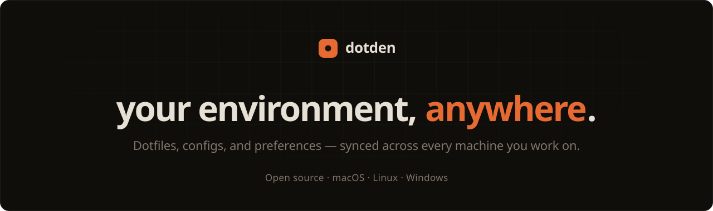

<p align="center">
  
</p>

**dotden** keeps your environment yours.

Dotfiles, configs, and preferences follow you any environment, so any new setup feels like home in minutes.

private, portable, yours - You own the repository and the data — we just help keeping it in sync.

> Not another cloud drive: dotden is for your setup, not your photos.

## Development

Requires Node `>=24` and pnpm `>=11`. This repo pins pnpm `11.6.0` — install it standalone rather than via Corepack.

```sh
pnpm install     # install workspace deps
pnpm dev         # run all apps
pnpm check       # typecheck + lint
pnpm build       # build all apps
```

Scope to a single app through Turborepo:

```sh
pnpm dev -- --filter=@dotden/desktop
pnpm build -- --filter=@dotden/web
```

Keep environment files inside the app that consumes them; there is no root `.env`.

## Contributing

Contributions are welcome. See [CONTRIBUTING.md](CONTRIBUTING.md) for monorepo conventions and how to add an app or package, and the [Code of Conduct](CODE_OF_CONDUCT.md). To report a vulnerability, see [SECURITY.md](SECURITY.md).

## License

[MIT](LICENSE) © dotden contributors
